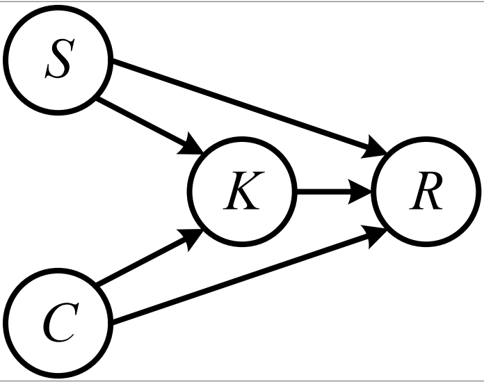
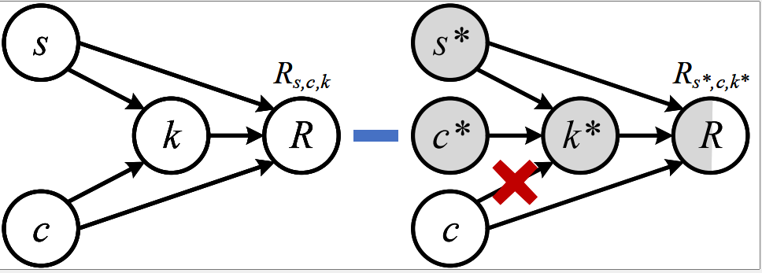
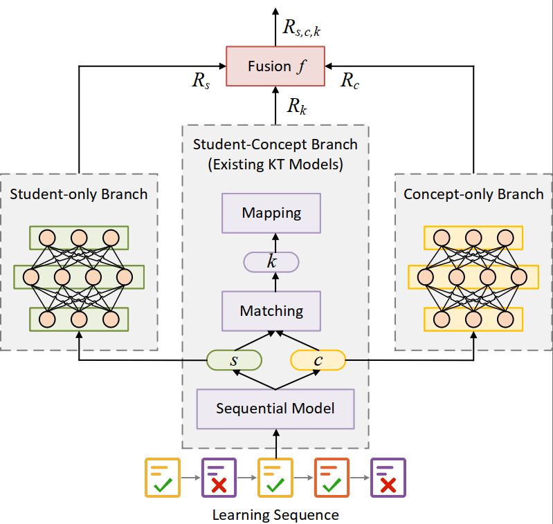

# DGEKT
The implementation of the paper *Do We Fully Understand Students’ Knowledge States? Identifying and Mitigating Answer Bias in Knowledge Tracing*

## Abstract
Knowledge tracing (KT) aims to monitor students’ evolving knowledge states through their learning interactions with concept-related questions, and can be indirectly evaluated by predicting how students will perform on future questions. In this paper, we observe that there is a common phenomenon of answer bias, i.e., a highly unbalanced distribution of correct and incorrect answers for each question. Existing models tend to memorize the answer bias as a shortcut for achieving high prediction performance in KT, thereby failing to fully understand students’ knowledge states. To address this issue, we approach the KT task from a causality perspective.A causal graph of KT is first established, from which we identify that the impact of answer bias lies in the direct causal effect of questions on students’ responses. A novel COunterfactual REasoning (CORE) framework for KT is further proposed, which separately captures the total causal effect of students and questions, as well as the direct causal effect of questions during training. It mitigates answer bias by subtracting the latter from the former in testing. The CORE framework is applicable to various existing KT models, and we implement it based on the prevailing DKT, DKVMN, and AKT models, respectively. Extensive experiments on three      benchmark datasets demonstrate the effectiveness of CORE in making the debiased inference for KT. 

## Causal Graph


## Difference between TE and NDE in Counterfactual Reasoning


## Overall Architecture


## Dataset
We evaluate our method on three benchmark datasets for knowledge tracing, i.e., ASSIST09, ASSIST17, and EdNet.
In addition to the ASSIST17 dataset provided in the code, the ASSIST09 and EdNet datasets which mentioned in the paper are in the Google Drive, which you can download with this [link](https://drive.google.com/drive/folders/19Uv_elM5xfV5Ocv4WieRRIkcKsKa3ZE_?usp=sharing).

## Models

 - `/model/DKT/dkt.py`:original DKT model;
 - `/model/DKT/dkt_core.py`:DKT-CORE model based on CORE framework;
 - `/model/DKVMN/dkvmn.py`:original DKVMN model;
 - `/model/DKVMN/dkvmn_core.py`:DKVMN-CORE model based on CORE framework;
 - `/model/AKT/akt.py`:original AKT model
 - `/model/AKT/akt_core.py`:AKT-CORE model based on CORE framework;
 - `/model/SAIKT/saint.py`:original saint model;
 - `/model/sAKT/sakt_core.py`:original sakt model;

## Setup

To run this code you need the following:

    a machine with GPUs
    python3.7
    numpy, pandas, scipy, scikit-learn, tqdm, sklearn and torch packages:
```
pip3 install torch==1.7.0 numpy==1.21.2 pandas==1.4.1 scipy==1.7.3 scikit-learn==1.0.2 tqdm==4.26.3 
```
## Hyperparameter Settings
`/configs/data_config.json` and `/configs/kt_config.json` are specially used to set super parameters, all parameters of the whole model can be set in this file.

> MAX_STEP = 200 
> BATCH_SIZE = 128 
> LR = 0.001 
> EPOCH = 200 
> EMB = 64 
> HIDDEN = 64 


## Save Log

If you need to save the log, create a `log` folder under the evaluation folder.
There are trained models in the `evaluation/checkpoint` folder, which can be directly test in  `test.py`  . 
Of course, you can also train a new models, just  run  `run.py`

## Contact us
If you have any questions, please contact smile_lucky_dog@163.com.
